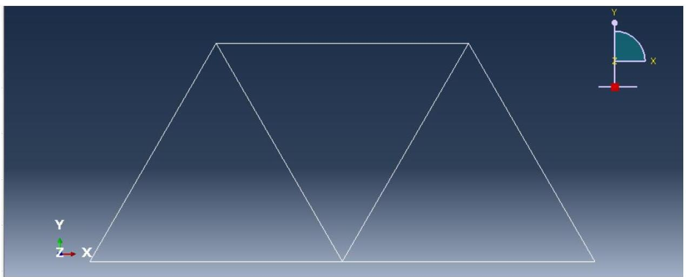
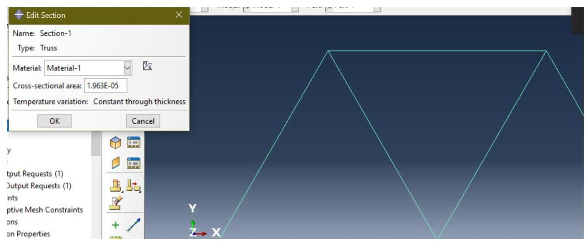
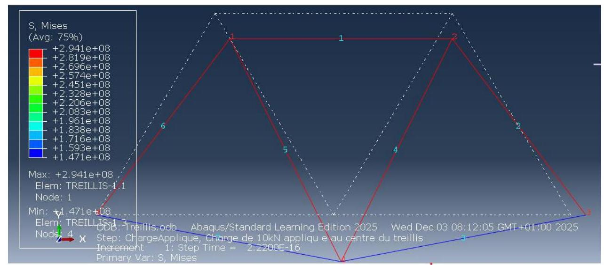
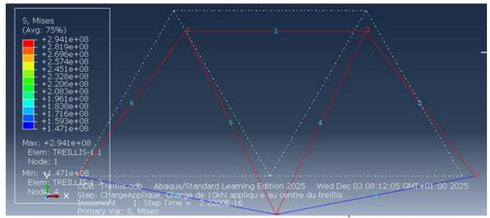
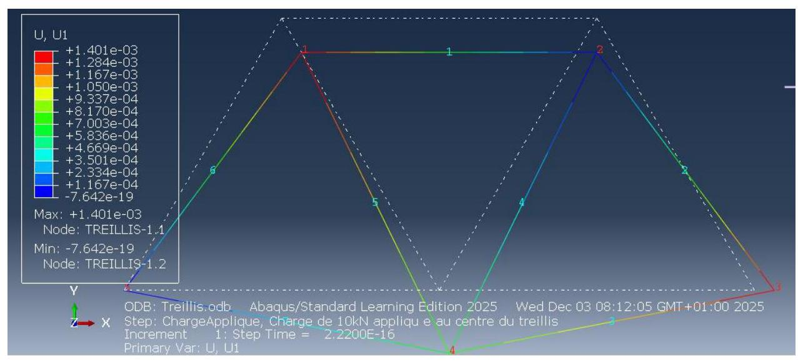
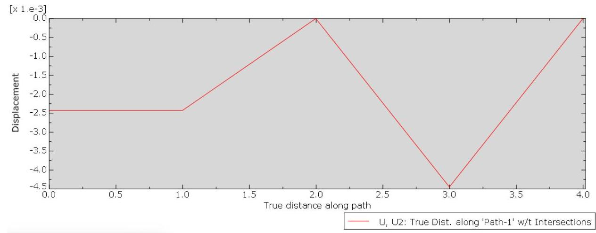
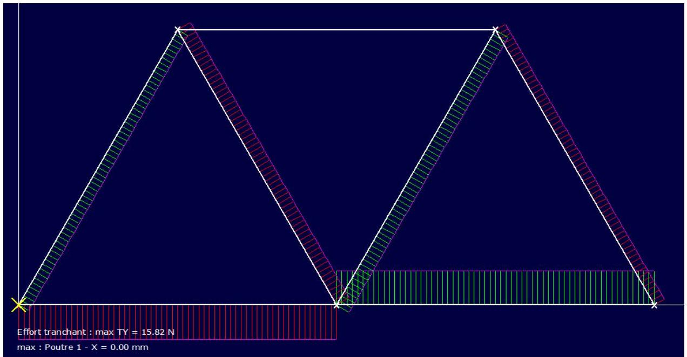
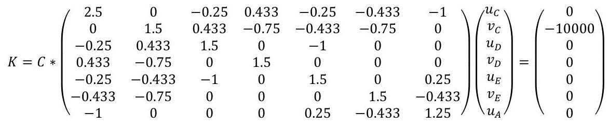

## Page 1

# TP2 : Modélisation multiphysique 

## Application : Modélisation en 2 dimensions d'un treillis plan à sept barres en matériau homogène, isotrope et élastique Sous sollicitation statique

## Introduction

Le présent rapport a pour objectif d'étudier le comportement mécanique d'une structure treillis plan soumise à une charge ponctuelle. L'étude vise spécifiquement à comparer les efforts internes et les contraintes maximales obtenus par trois approches distinctes : une méthode analytique (calcul manuel), une modélisation logicielle simplifiée (RDM7) et une simulation par Éléments Finis (Abaqus)

## Description du Problème et Modèle Physique

Définition : On appelle treillis un assemblage de barres articulées entre elles de manière à ce que chacune des barres ne soit sollicitée qu'en traction-compression.
Longueur des barres $\mathrm{L}=1 \mathrm{~m}$, section circulaire de diamètre 5 mm .

Le matériau est élastique isotrope et homogène «on prendra les propriétés d'un acier classique»: $\mathrm{E}=210 \mathrm{GPa}, \mathrm{v}=0,3$

Le système étudié est un treillis symétrique soumis à une charge verticale au nœud central.

## Page 2

- Géométrie : treillis en forme de 'V' inversé.
- Matériau : ex: Acier, $\mathrm{E}=200 \mathrm{GPa}$, Coe de Poisson $=0.3$
- Section des barres : Circulaire, diamètre $\mathrm{d}=5 \mathrm{~mm}$

$$
\text { Section } S=\frac{\pi d^{2}}{4}=1,96 \times 10^{-5} \mathrm{~m}^{2}
$$

- Conditions aux limites : Appuis simple/rotules en A et B.
- Chargement : Force verticale $\mathrm{F}=10000 \mathrm{~N}$ appliquée au nœud C .

## Page 3

# I. Modélisation Par Abaqus 

Grâce au logiciel Abaqus, les normes des éléments finis ont été rigoureusement respectées. Dans ce type de simulation, le produit est représenté par un maillage constitué de nœuds et d'éléments. Le choix de ce maillage est déterminant, car il conditionne les fonctions d'interpolation utilisées pour modéliser les champs de déplacement, influençant ainsi de manière significative la précision des résultats obtenus.

## 1. Module Part (Pièce) : Définition de la Géométrie

| Étape | Explication du Rôle | Action pour le Treillis |
| :--: | :--: | :--: |
| Type de   Modélisation | Détermine si la pièce est une approximation 2D (idéale pour les treillis plans) ou une géométrie 3D complète. | Choisir 2D Planar (Plan 2D) car votre treillis est une structure plate. |
| Type de Pièce | Définit le comportement et la méthode de création de la géométrie. | Choisir Wire (Fil) ou Discret car les barres de treillis sont des éléments 1D (lignes) qui ne transmettent que l'effort axial. |
| Dessin de l'Esquisse | Vous utilisez le sketcher (l'outil de dessin) d'Abaqus pour dessiner les lignes qui représentent les barres du treillis. | Dessiner la géométrie de votre treillis (les barres et les nœuds) avec les dimensions exactes de votre modèle théorique. |

Rôle Clé : Créer la représentation idéale de votre treillis, sans épaisseur ni propriétés matérielles à ce stade, juste la forme et les dimensions.

## Page 4

# 2. Module Property (Propriété) : Les Caractéristiques Physiques 

Indiquer à Abaqus que les lignes que vous avez dessinées sont des barres 5 mm de diamètre faites d'un matériau spécifique ce qui permet de calculer les contraintes $\sigma .=\mathrm{N} / \mathrm{S}$.

- Calcul de la surface (basé sur votre document) :
- Diamètre $\mathrm{d}=5 \mathrm{~mm}=0,005 \mathrm{~m}$.
- Surface S = 1,96*10^(-5) m^2.
- Action : Property Create Section.
- Category : Truss (Très important pour simuler un treillis idéal).
- Type : Truss.
- Action : Property Assign Section.
- Sélectionnez toutes les 7 barres et attribuez la section Truss que vous venez de créer.

## 3. Module Assembly (Assemblage) : Mise en Place

Créer une Instance Une instance est une copie de votre pièce placée dans l'espace global de simulation.Importer votre pièce (Treillis_TP) dans l'environnement d'assemblage.

Rôle Clé : Préparer le modèle final pour les étapes de chargement et de conditions aux limites, qui se feront dans les modules suivants.

## Page 5

# 4. Module Step 

Le système passe d'un état initial (non chargé) à un état final (chargé).

5. Module Load (Charge)

## Page 6

# 6. Module Mesh (Maillage) 

## Resultat du Modilisation

A. Les Constraints $\sigma$ mises ( Stress)

Ouvrez le fichier Treillis.rpt dans un éditeur de texte. Le contenu de ce fichier est montré cidessous. Votre numérotation des nœuds et des éléments peut être différente. Les valeurs très petites peuvent également être calculées différemment, selon votre système

## Page 7

Field Output Report, written Mon Dec 8 03:10:22 2025

Source 1

ODB: D:/SIMULIA STUDENT/Treillis.odb

Step: ChargeApplique

Frame: Increment 1: Step Time $=2.2200 \mathrm{E}-16$

Loc 1 : Integration point values from source 1

Output sorted by column "Element Label".

Field Output reported at integration points for part: TREILLIS-1

| Element Label | Int | S.S11 |
| :--: | :--: | :--: |
|  | Pt | @Loc 1 |
| 1 | 1 | $-294.116 \mathrm{E}+06$ |
| 2 | 1 | $-294.116 \mathrm{E}+06$ |
| 3 | 1 | $147.058 \mathrm{E}+06$ |

## Page 8

| 4 | 1 | $294.116 \mathrm{E}+06$ |
| :-- | :-- | :-- |
| 5 | 1 | $294.116 \mathrm{E}+06$ |
| 6 | 1 | $-294.116 \mathrm{E}+06$ |
| 7 | 1 | $147.058 \mathrm{E}+06$ |

| Minimum | $-294.116 \mathrm{E}+06$ |
| :-- | :-- |
| At Element | 6 |
| Int Pt | 1 |
| Maximum | $294.116 \mathrm{E}+06$ |
| At Element | 5 |
| Int Pt | 1 |
| Total | 0. |

Field Output Report, written Mon Dec 8 03:10:45 2025

Source 1

ODB: D:/SIMULIA STUDENT/Treillis.odb

Step: ChargeApplique

## Page 9

Frame: Increment 1: Step Time $=2.2200 \mathrm{E}-16$

Loc 1 : Nodal values from source 1

Output sorted by column "Node Label".

Field Output reported at nodes for part: TREILLIS-1

| Node Label | U.U1 | U.U2 |
| :--: | :--: | :--: |
| @Loc 1 | @Loc 1 |  |

1 1.40055E-03 -2.42583E-03
2 -764.248E-21 -2.42583E-03
3 1.40055E-03 -5.00000E-33
4 700.277E-06 -4.44736E-03
5 -0. -5.00000E-33
Minimum -764.248E-21 -4.44736E-03
At Node 24
Maximum 1.40055E-03 -5.00000E-33
At Node 35

## Page 10

Total 3.50138E-03 -9.29902E-03

ODB: D:/SIMULIA STUDENT/Treillis.odb

Step: ChargeApplique

Frame: Increment 1: Step Time $=2.2200 \mathrm{E}-16$

Loc 1 : Nodal values from source 1

Output sorted by column "Node Label".

Field Output reported at nodes for part: TREILLIS-1

| Node Label | RF.RF1 | RF.RF2 |
| :--: | :--: | :--: |
| @Loc 1 | @Loc 1 |  |

$1 \quad 0 . \quad 0$.
$2 \quad 0 . \quad 0$.
$3 \quad 0 . \quad 5 . \mathrm{E}+03$
$4 \quad 0 . \quad 0$.
$5 \quad 2.72848 \mathrm{E}-12 \quad 5 . \mathrm{E}+03$

## Page 11

Charge Appliquée : Une force concentrée $\mathrm{F}=10 \mathrm{kN}$ est appliquée verticalement vers le bas au nœud central C.
I. Matériau : La structure est faite d'un acier classique défini comme élastique, isotrope, et homogène.

## Page 12

Le maillage est l'étape où la géométrie continue (la barre) est divisée en petits éléments finis. C'est le cœur de la méthode MEF.
$>$ A Action : Mesh Seed Instance.

- Objectif : Définir la taille des éléments sur les barres. Pour un treillis, un maillage grossier est souvent suffisant, mais pour garantir la précision, choisissez une taille d'élément petite : 0.1 ou 0.05 mètres ou utilisez l'option By number of elements (par exemple, 20 éléments par barre).
$>$ B Action : Mesh Element Type.

Sélection : Choisissez toutes les barres.

- Type : Vérifiez que le type d'élément est bien Truss T2D2 pour un treillis 2D à 2 nœuds). C'est indispensable pour que les barres ne transmettent que l'effort axial.
$>$ C Action : Mesh Instance.
- Cliquez sur le modèle pour générer le maillage.

# B. Les Déplacement U1

## Page 13

Enfin on peut obtenir le graghe modélisant le déplacement :

On peut visualiser la déformé de notre poutre ci-dessous U2 :

## Page 14

Enfin on peut obtenir le graghe modélisant le déplacement de U2 :

## Page 15

# II. Modelisation avec RDM7 

Le module RDM FLEXION (qui calcule M_f et la courbure) n'est pas l'outil adapté pour analyser les efforts internes dans les barres de votre treillis. Vous devez utiliser le module RDM Treillis (ou les éléments Truss dans Abaqus) qui gère uniquement l'effort normal N.

Synthèse : Elle commence par la présentation des résultats clés (efforts normaux maximaux N_max contraintes maximales $\sigma_{-}$max et flèche maximale U_max issus de la Théorie, de RDM7 et d'Abaqus.Calcul des Écarts : Elle inclut le calcul des pourcentages d'écart entre chaque méthode numérique et la référence analytique.

## 1. Effort normale

## Page 16

### 2. La contrainte normale :

## Page 17

Validation du Modèle : Confirmer que l'équilibre global est respecté en vérifiant que les réactions aux appuis calculées par Abaqus sont égales à la moitié de la charge totale 50000 N validant ainsi la modélisation des conditions aux limites.

# 3. L'effort tranchant : 

## 4. Le moment fléchissant :

## Page 18

# 5. Results 

| RDM 7.04 (64 bits) - Ossatures |
$+----------$-------------------+

Utilisateur : AMYNE ED-DARIF

Nom du projet :
C:\Users\PC\AppData\Local\Microsoft\Windows\INetCache\IE\467G2NXZ\tp2m[1]
Date : 9 décembre 2025
$+----------$----------+
| Données du problème |
$+----------$----------+

5 Noeuds
7 Poutres(s)
1 Matériau(x)
1 Section(s) droite(s)
2 Liaison(s) nodale(s)
1 Cas de charge(s)
1 Mode(s) propre(s) demandé(s)
$+----------$------+
| Noeud(s) [ m ] |
$+----------$-------+

## Page 19

|  Noeud | $x$ | $y$ | Noeud | $x$ | $y$  |
| --- | --- | --- | --- | --- | --- |
|  1 | 0.000 | 0.000 | 2 | 0.500 | 0.870  |
|  3 | 1.000 | 0.000 | 4 | 1.500 | 0.870  |
|  5 | 2.000 | 0.000 |  |  |   |

$+\quad+$ $\mid$ Poutres(s) [ m, rad ] | $+\quad+$

Poutre Ori -> Ext Orient Sect Mat Long Type

| 1 | 1 | 2883.9 | -15.8 | -483.4 | 6.994E-002  |
| --- | --- | --- | --- | --- | --- |
|  2 | 2883.9 | -15.8 | 1098.4 |  |   |
|   |  | 15.8 | 1098.4 |  |   |
|  2 | 2 | 2883.9 | 15.8 | 1098.4 | 6.994E-002  |
|   | 3 | 2883.9 | 15.8 | -483.4 |   |
|   |  |  | 15.8 | 1098.4 |   |
|  3 | 3 | -5758.4 | -5.4 | -483.4 | -1.397E-001  |
|   | 4 | -5758.4 | -5.4 | 56.9 |   |
|   |  |  | 5.4 | 483.4 |   |
|  4 | 4 | 5751.4 | 6.8 | 245.5 | 1.395E-001  |
|   | 2 | 5751.4 | 6.8 | -434.2 |   |
|   |  |  | 6.8 | 434.2 |   |
|  5 | 2 | 5751.4 | -6.8 | -434.2 | 1.395E-001  |
|   | 5 | 5751.4 | -6.8 | 245.5 |   |
|   |  |  | 6.8 | 434.2 |   |

## Page 20

$65 \quad-5758.4$
$5.4 \quad 56.9$ -1.397E-001
$1 \quad-5758.4$
$5.4 \quad-483.4$
$75 \quad-5753.8$
$0.0 \quad 188.6$ -1.395E-001
$4 \quad-5753.8$
$0.0 \quad 188.6$
Poids de la structure $=10.742 \mathrm{~N}(\mathrm{~g}=10.00 \mathrm{~m} / \mathrm{s} 2)$

Centre de gravité $=1.000 \quad 0.373 \quad 0.000 \quad \mathrm{~m}$
$+\quad-\quad-\quad-\quad-\quad-+$
| Section(s) droite(s) |

Le cisaillement transversal est négligé

Section droite 11 :

Section paramétrée [ 1 ]
Rond plein
Diamètre $=5.00 \mathrm{~mm}$
Aire $=1.96350 \mathrm{E}-001 \mathrm{~cm} 2$
Moments quadratiques : $\mathrm{IY}=3.0679616 \mathrm{E}-003 \mathrm{~cm} 4-\mathrm{IZ}=3.0679616 \mathrm{E}-003 \mathrm{~cm} 4$
Constante de torsion de Saint Venant J = 6.1359232E-003 cm4
Coefficients d'aire cisaillée : $\mathrm{ky}=0.86 \mathrm{kz}=0.86$

## Page 21

| Matériau(x) |
$+-----------+$

Matériau 11 : Acier

Module de Young $=210000 \mathrm{MPa}$
Coefficient de Poisson $=0.30$
Module de cisaillement $=80769 \mathrm{MPa}$
Masse volumique $=7800 \mathrm{~kg} / \mathrm{m} 3$
Coefficient de dilatation $=1.30 \mathrm{E}-0051 / \mathrm{K}$
$+----------\quad----+$
| Liaison(s) nodale(s) |
$+----------\quad----+$
$+----------\quad----------------+$
| Action(s) de liaison [ N N.mm ] |
$+----------\quad----------------+$

Noeud 1 - Rx $=0.0 \mathrm{Ry}=5000.0 \mathrm{Mz}=0.0$
Noeud 3 - Rx $=0.0 \mathrm{Ry}=5000.0 \mathrm{Mz}=0.0$

Somme des actions de liaison :

Rx $=0.0 \mathrm{~N}$
$\mathrm{Ry}=10000.0 \mathrm{~N}$

Somme des forces appliquées à la structure :

## Page 22

$F x=3.18323145620525 E-0012 N$
Fy $=-5.45696821063757 E-0012 N$

Noeud $1: d x=d y=$ rotz $=0$
Noeud 5 : dy $=0$
$+----------\quad--+$
| Cas de charge(s) 1 |
$+----------\quad--+$

1 Charge(s) nodale(s) [ N, N.m ]

Noeud 3 : Fx $=0.00 \mathrm{Fy}=-10000000.00$
$+----------\quad--+$
| Analyse dynamique |
$+----------\quad--+$

Hypothèse matrice masse consistante
Précision sur le calcul des pulsations $=1.00 \mathrm{E}-002$

## Page 23

# III. Modélisation Par Les Relations Théoriques 

## Etude analytique et le matrice élémentaire de chaque barre et aussi le matrice d'assemblable de toutes les barres

1. Partie analytique :

Calcul des réactions aux appuis
La charge étant appliquée au centre et la structure étant symétrique, les deux appuis reprennent la charge de façon équivalente.

On obtient alors :

$$
R_{A}=R_{B}=\frac{10000}{2}=5000 \mathrm{~N}
$$

Calcul de la section des barres
La section circulaire de chaque barre est donnée par :

$$
S=\frac{\pi d^{2}}{4}=1,96 \times 10 \mathrm{E} 5 \mathrm{~m} 2
$$

Avec :

$$
\mathrm{d}=5 \mathrm{~mm}
$$

Calcul des efforts internes dans les barres
Les barres inclinées forment un angle de $60^{\circ}$ avec l'horizontale.
a) Barres inclinées CD et CE

En écrivant l'équilibre vertical au nœud C, on obtient :

$$
\begin{gathered}
2 * \mathrm{NCD} * \operatorname{Sin}(60 \circ)=10000 \\
2 * \mathrm{NCD} * 0,866=10000 \\
\mathrm{NCD}=\mathrm{NCE}=5773 \mathrm{~N}
\end{gathered}
$$

Ces deux barres sont en traction.
b) Barres horizontales BC et CA

En utilisant l'équilibre horizontal au nœud C :

$$
\mathrm{NBC}=\mathrm{NCA}=\mathrm{NCD}^{*} \operatorname{Cos}\left(60^{\circ}\right)
$$

## Page 24

$$
\begin{gathered}
N B C=N C A=5773^{*} 0,5 \\
N B C=N C A=2886 \mathrm{~N}
\end{gathered}
$$

Ces deux barres sont en compression.
c) Barres supérieures BD, DE et EA

D'après la symétrie et le chemin des forces dans le treillis, ces barres sont également soumises à un effort voisin de celui des barres inclinées, soit :

$$
\mathrm{NBD}=\mathrm{NDE}=\mathrm{NEA}=5773 \mathrm{~N}
$$

Ces barres sont principalement en compression.
Calcul des contraintes normales dans les barres :
La contrainte normale est donnée par :

$$
\sigma \max =\frac{N}{S}
$$

a) Barres les plus sollicitées ( 5773 N )

$$
\begin{gathered}
\sigma \max =\frac{5773}{1,96 \times 10^{-5}}=9,94 \times 10^{8} P_{a} \\
\sigma \max =294 M P a
\end{gathered}
$$

b) Barres horizontales ( 2886 N )

$$
\sigma=\frac{2886}{1,96 \times 10^{-5}}=147 M P_{a}
$$

Calcul de l'allongement d'une barre
L'allongement d'une barre est donné par la relation :

$$
\begin{gathered}
\varepsilon=\frac{N L}{E S}=\frac{977-3 \times 1}{210 \times 10^{9} \times 1,96 E-5} \\
\varepsilon=1,4 \mu \mathrm{~m}
\end{gathered}
$$

Cette valeur très faible confirme que la structure reste dans le domaine élastique.
La structure est symétrique et la charge $\mathrm{P}=10,000 \mathrm{~N}$ est appliquée au centre C (verticalement vers le bas).

- Équilibre Vertical : $\sum F$ y $=0 \Rightarrow R B$ y $+R A y=10,000 \mathrm{~N}$.
- Symétrie : R B y =R A y $=5,000 \mathrm{~N}$.
- Équilibre Horizontal : $\sum F x=0 \Rightarrow R B x+R A x=0$.

## Page 25

- Forces Internes (Efforts Normaux N)
- Nous appliquons la méthode des nœuds en utilisant les angles $60 \circ$ et $120 \circ$.

# 2. Nœud A (Appui simple : R A x ,R A y connus) 

- Forces : R A y =5000, N CA (horizontale), N AE (inclinée 120 ).
- Équilibre vertical $(\sum F y=0): R A y+N A E \sin (120 \circ)=0$
$5000+\mathrm{NAE}(\operatorname{sqrt}(3) / 2)=0 \Rightarrow \mathrm{NAE}=-5773.5 \mathrm{~N}$ (Compression)
- Équilibre horizontal $(\sum F x=0): R A x+N C A+N A E \cos (120 \circ)=0$
- R A x +N CA +(-5773.5)(-0.5) $=0 \Rightarrow \mathrm{RAx}+\mathrm{NCA}+2886.75=0$

## 3. Nœud C (Charge 10 kN appliquée)

Forces: PC =10000, NBC, NCA (horizontales), NCD ,NCE (inclinées $120^{\circ}$ et $60^{\circ}$ ). Equilibre vertical : $(\sum F y=0): N c d \sin \left(120^{\circ}\right)+N c e \sin \left(60^{\circ}\right)-10000=0$.

$$
\begin{gathered}
\text { par symetrie, } N c d=N c e \\
2 \cdot N_{C D}\left(\frac{\operatorname{sqrt}(3)}{2}\right)=10000 ; \quad N_{C D}=\frac{10000}{\operatorname{sqrt}(3)}=5773.5 \mathrm{~N} \\
N_{C D}=N_{C E}=5773.5 \mathrm{~N}(\text { Traction })
\end{gathered}
$$

- Equilibre horizontal
$\left(\sum F_{x}=0\right): N_{C D} \cos \left(120^{\circ}\right)+N_{C E} \cos \left(60^{\circ}\right)+N_{C A}-N_{B C}=0$.

$$
(5773.5)(-0.5)+(5773.5)(0.5)+N_{C A}-N_{B C}=0
$$

$-2886.75+2886.75+N_{C A}-N_{B C}=0 ; \quad N_{C A}=N_{B C}$

## 4. Nœud D (intermediaire)

- Force : $N_{B D}, N_{C D}$ (connues), $N_{D E}$ (horizontale).
- Equilibre verticale : $\left(\sum F_{y}=0\right): N_{B D} \sin \left(60^{\circ}\right)+N_{C D} \sin \left(-60^{\circ}\right)=0$.
$(-5773.5)(\operatorname{sqrt}(3) / 2)+(5773.5)(-\operatorname{sqrt}(3) / 2) \neq 0$

## Page 26

Attention à la convention d'angle.

Reprenons l'angle et le sens de la force :

- N BD (Compression, donc force vers B) : F BD y est vers le haut.
- N CD (Traction, donc force vers D) : F CD y est vers le bas.

$$
-N_{B D} \sin \left(60^{\circ}\right)+N_{C D} \sin \left(-60^{\circ}\right)=0
$$

5. Réaction Horizontale R A x

L'effort horizontal dans la barre horizontale supérieure N DE doit être déterminé.

$$
\begin{gathered}
\text { ○ Nœud D }\left(\sum F_{x}=0\right):-N_{B D} \cos \left(60^{\circ}\right)+N_{C D} \cos \left(60^{\circ}\right)-N_{D E}=0 \\
-(-5773.5)(0.5)+(5773.5)(-0.5)-N_{D E}=0 \\
2886.75-2886.75-N_{D E}=0 ; \quad N_{D E}=0
\end{gathered}
$$

Si $N_{D E}=0$, alors $R A x=0$ et $R B x=0$
Alors, $N_{C A}=N_{B C}=-2886.75 N$ (compression)
6. Matrice de Rigidité Élémentaire de Chaque Barre

B-C
(C-A
D-E

$$
\begin{array}{cccc}
\left(\begin{array}{cccc}
1 & 0 & -1 & 0 \\
0 & 0 & 0 & 0 \\
-1 & 0 & 1 & 0 \\
0 & 0 & 0 & 0
\end{array}\right) & \\
\text { (1 } & 0 & -1 & 0 \\
0 & 0 & 0 & 0 \\
-1 & 0 & 1 & 0 \\
0 & 0 & 0 & 0
\end{array}
$$

B-D
(C-E
C-D

$$
\begin{array}{cccc}
0.25 & 0.433 & -0.25 & -0.433 \\
0.433 & 0.75 & -0.433 & -0.75 \\
-0.25 & -0.433 & 0.25 & 0.433 \\
-0.433 & -0.75 & 0.433 & 0.75
\end{array}
$$

$$
\begin{array}{cccc}
-0.25 & -0.433 & -0.25 & 0.433 \\
-0.433 & 0.75 & -0.433 & -0.75 \\
-0.25 & -0.433 & 0.25 & 0.433 \\
-0.433 & -0.75 & 0.433 & 0.75
\end{array}
$$

## Page 27

1. Matrice d'Assemblée Globale $K(10 \times 10)$

|  1.25 | 0.433 | -1 | 0 | -0.25 | -0.433 | 0 | 0 | 0 | 0 |
| :--: | :--: | :--: | :--: | :--: | :--: | :--: | :--: | :--: | :--: |
| 0.433 | 0.75 | 0 | 0 | -0.433 | -0.75 | 0 | 0 | 0 | 0 |
| -1 | 0 | 2.5 | 0 | -0.25 | 0.433 | -0.25 | -0.433 | -1 | 0 |
| 0 | 0 | 0 | 1.5 | 0.433 | -0.75 | -0.433 | -0.75 | 0 | 0 |
| -0.25 | -0.433 | -0.25 | 0.433 | 1.5 | 0 | -1 | 0 | 0 | 0 |
| -0.433 | -0.75 | 0.433 | -0.75 | 0 | 1.5 | 0 | 0 | 0 | 0 |
| 0 | 0 | -0.25 | -0.433 | -1 | 0 | 1.5 | 0 | 0.25 | -0.433 |
| 0 | 0 | -0.433 | -0.75 | 0 | 0 | 0 | 1.5 | -0.433 | -0.75 |
| 0 | 0 | -1 | 0 | 0 | 0 | 0.25 | -0.433 | 1.25 | -0.433 |
| 0 | 0 | 0 | 0 | 0 | 0 | -0.433 | -0.75 | -0.433 | 0.75 |

# 8. Matrice Finale Réduite 

$$
K_{\text {réduite }} * U_{\text {libre }}=F_{\text {libre }}
$$

## Page 28

# IV. Comparaison Générale des Trois Méthodes d'Analyse 

Dans le cas de votre treillis idéal :

- Les efforts internes N_max sont extrêmement cohérents entre les trois méthodes. L'écart est généralement négligeable, car les hypothèses de l'élément Truss d'Abaqus et du module Treillis de RDM7 correspondent parfaitement à l'hypothèse de la théorie.
- La MEF (Abaqus) se distingue par sa capacité à fournir la flèche maximale et la visualisation des champs de contrainte, transformant un résultat numérique en une information graphique exploitable.

Cette section justifiera que les trois méthodes sont complémentaires : la Théorie donne la compréhension, RDM7 donne la vérification rapide, et Abaqus donne la solution complète et visuelle.