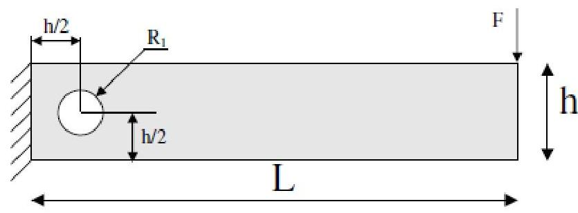
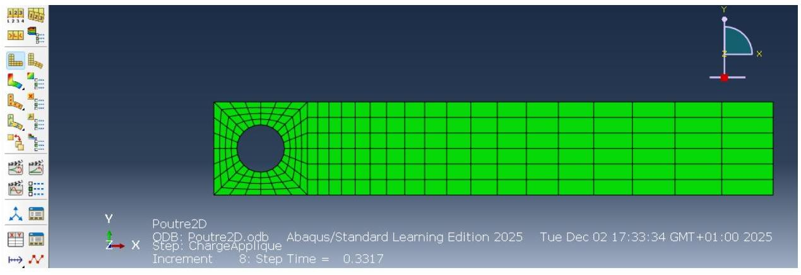
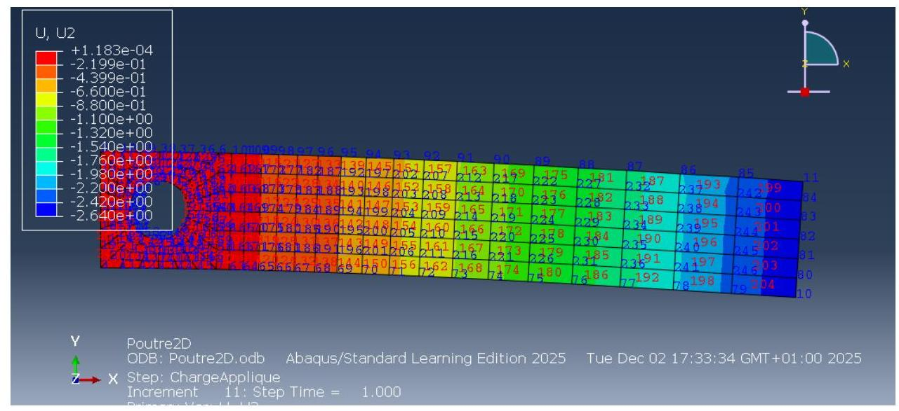
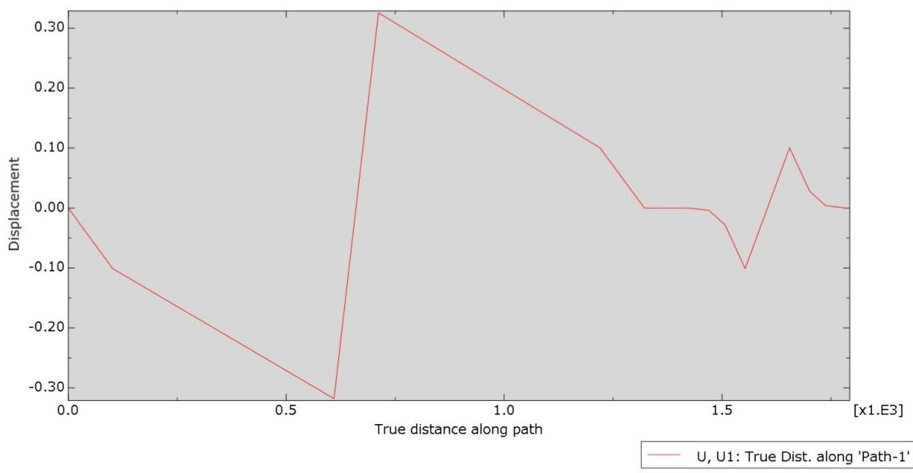
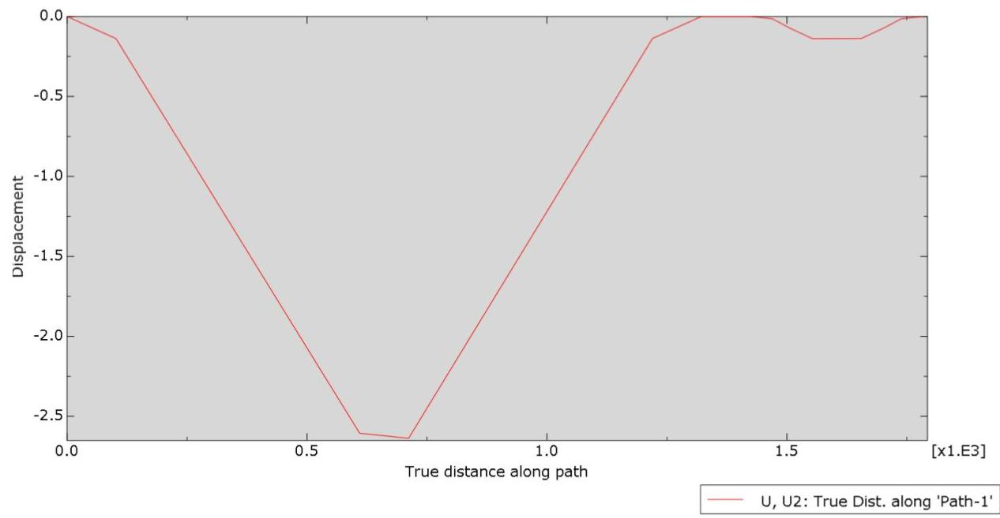
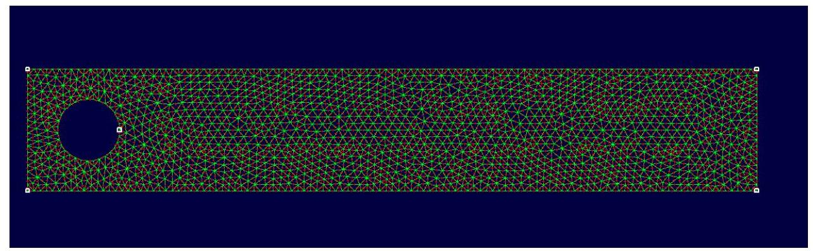
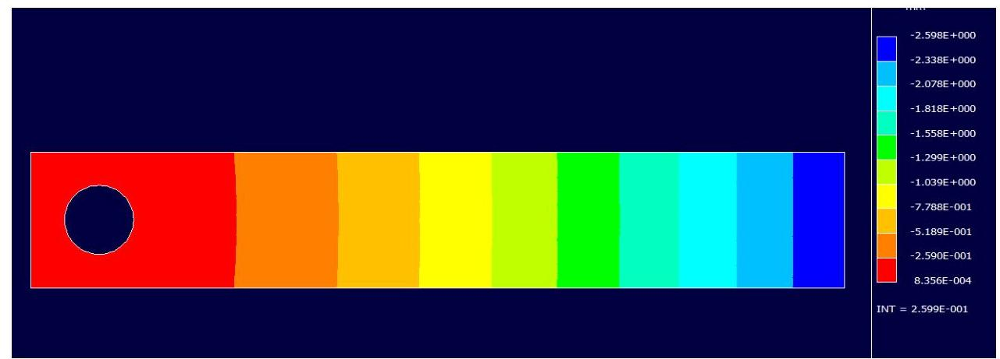

## Page 1

# TP3 : Modélisation en 2 dimensions d'une poutre de forme rectangulaire trouée, homogène et isotrope en élastoplasticité sous sollicitation statique 

## I. Introduction :

La simulation numérique constitue un outil fondamental pour l'étude du comportement mécanique des structures complexes. Elle permet d'analyser la distribution des contraintes et des déformations, de prévoir les zones critiques et de réduire le recours aux essais expérimentaux coûteux. Abaqus, logiciel de référence en simulation par éléments finis, offre un cadre complet pour modéliser des structures soumises à différentes sollicitations, qu'elles soient linéaires ou non linéaires, élastiques ou plastiques.

Dans le cadre de ce TP, nous nous intéressons à la modélisation en deux dimensions d'une poutre rectangulaire trouée, réalisée dans un matériau homogène et isotrope présentant un comportement élasto-plastique, sous une sollicitation statique. Cette étude permet de mettre en évidence l'effet d'un trou sur la concentration des contraintes et sur la propagation des zones plastifiées, tout en appliquant les principes fondamentaux de la mécanique des solides et de la plasticité.

## Page 2

# II. Problématique : 

Comment modéliser correctement une poutre rectangulaire trouée en élasto-plastique sous sollicitation statique afin de prédire les zones de concentration de contraintes et de déformations plastiques, tout en assurant la fiabilité des résultats numériques obtenus avec Abaqus ?

Cette question soulève plusieurs points clés :

- Quelle approche numérique (éléments finis 2D, plane stress ou plane strain) est la plus adaptée pour cette géométrie ?
- Comment choisir le type de maillage et son raffinement autour du trou pour obtenir des résultats précis ?

- Comment représenter correctement le comportement élasto-plastique du matériau?
- Quels critères utiliser pour interpréter les zones plastifiées et les champs de contraintes ?

Ce TP vise ainsi à fournir une démarche complète et rigoureuse de modélisation, simulation et analyse des résultats pour mieux comprendre l'influence de la géométrie et du matériau sur le comportement mécanique de la poutre.

## III. Partie théorique :

## 1. Cas d'étude :

Poutre encastrée sous charge répartie :
Etude d'une poutre en flexion en 2D : Longueur de la poutre $\mathrm{L}=610 \mathrm{~mm}$, section rectangulaire de $\mathrm{h}=102 \mathrm{~mm}, \mathrm{~b}=25,4 \mathrm{~mm}$. Le rayon du trou $\mathrm{R} 1=26 \mathrm{~mm}$.

## Page 3

# 2. Calculs : 

### 2.1. Moment d'inertie sans trou :

Pour une section rectangulaire :

$$
\begin{aligned}
& I=\frac{b h^{3}}{12} \\
& I=\frac{25,4 \times 102^{3}}{12} \mathrm{~mm}^{4}
\end{aligned}
$$

Calcul :

$$
\begin{aligned}
& 102^{3}=1061208 \mathrm{~mm}^{3} \\
& I=\frac{25,4 \times 1061208}{12} \approx 2247258 \mathrm{~mm}^{4}
\end{aligned}
$$

Le matériau est élastoplastique isotrope et homogène «on prendra les propriétés d'un acier classique»:

2.2. Réduction de l'inertie à cause du trou :

## Page 4

Pour un trou circulaire centré :

$$
I_{\mathrm{eff}}=I_{\text {rect }}-I_{\text {trou }}
$$

Moment d'inertie du trou autour de son axe neutre :

$$
\begin{aligned}
& I_{\text {trou }}=\frac{\pi R_{1}^{4}}{4}(\text { pour axe passant par le centre }) \\
& R_{1}^{4}=26^{4}=456976 \\
& I_{\text {trou }}=\frac{3,1416 \times 456976}{4} \approx 358521 \mathrm{~mm}^{4} \\
& I_{\text {eff }} \approx 2247258-358521 \approx 1888737 \mathrm{~mm}^{4}
\end{aligned}
$$

# 3. Flexion : Contraintes et déformations : 

### 3.1. Contrainte maximale

$$
\sigma \max =\operatorname{Mmax}^{*} \mathrm{c} / \mathrm{I}_{\mathrm{eff}} . \text { Où : }
$$

- $M_{\max }=$ moment fléchissant maximal
- $c=h / 2=51 \mathrm{~mm}$
- $I_{\text {eff }}=1888737 \mathrm{~mm}^{4}$

### 3.2. Déformation maximale :

$$
\varepsilon \max =\sigma \max / E
$$

## 4. Plasticité : Critère de Von-Mises :

Pour flexion pure :

$$
\begin{aligned}
& \sigma_{x}=\text { contrainte de flexion, } \sigma_{y}=0, \tau_{x y}=0 \\
& \sigma_{\mathrm{eq}}=\sigma_{x}
\end{aligned}
$$

- Début de plastification : $\sigma_{\max } \geq \sigma_{y}=210 \mathrm{MPa}$
- Déformation plastique équivalente (écrouissage isotrope) :

$$
\varepsilon_{p}=\frac{\sigma_{\max }-\sigma_{y}}{E_{\mathrm{f}}}
$$

5. Moment plastique de la section rectangulaire :

## Page 5

Module de résistance plastique :

$$
\begin{aligned}
& Z=\frac{b h^{2}}{4}=\frac{25,4 \times 102^{2}}{4} \approx 66114 \mathrm{~mm}^{3} \\
& M_{p}=210 \times 66114 \approx 13883940 \mathrm{~N} . \mathrm{mm} \approx 13,88 \mathrm{kN} . \mathrm{m}
\end{aligned}
$$

# 6. Relations élasto-plastiques : 

- Si $M<M_{y}$ : section élastique

$$
\sigma=\frac{M c}{I_{\mathrm{eff}}}
$$

- Si $M \geq M_{y}$ : développement de zones plastiques

$$
\sigma=\sigma_{y}+E_{t} \varepsilon_{p}
$$

Déformations :

$$
\begin{aligned}
& \varepsilon_{\max }=\frac{\sigma_{\max }}{E}(\text { élastique }) \\
& \varepsilon_{p}=\frac{\sigma_{\max }-\sigma_{y}}{E_{t}}(\text { plastique })
\end{aligned}
$$

## IV. Partie pratique :

## Etapes principales :

Les étapes pour modéliser une poutre trouée en élastoplasticité sous sollicitation statique dans ABAQUS sont :

1. Géométrie : Dessiner la poutre en 2D avec les trous.
2. Propriétés du matériau : Définir un matériau homogène, isotrope et élastoplastique.
3. Sections: Associer les propriétés du matériau à la géométrie.
4. Conditions aux limites et chargement : Appliquer les appuis et les charges statiques.
5. Maillage : Générer un maillage précis, avec raffinement autour des trous.
6. Analyse : Configurer une étape statique pour inclure la plasticité.
7. Calcul et résultats : Lancer le calcul, puis analyser les déformations et contraintes.

## Page 6

# A. Analyse de résultat : 

Pour garantir la pertinence de la modélisation, la construction du maillage doit respecter plusieurs principes essentiels. Elle doit notamment prendre en compte : l'adaptation de la géométrie au type de simulation effectuée, le choix approprié des éléments finis, la génération et la qualité du maillage, ainsi que la prise en compte adéquate des conditions extérieures appliquées au modèle.

## Page 7

La figure ci-dessus présente la distribution des contraintes équivalentes de Von Mises obtenue après la simulation par éléments finis de la poutre rectangulaire trouée sous chargement en flexion. Les résultats montrent une concentration importante des contraintes autour du perçage, ce qui était attendu en raison de la discontinuité géométrique qui provoque une perturbation locale du champ des contraintes.

On observe que la contrainte maximale atteint environ 214 MPa , localisée au niveau de la zone supérieure du trou, là où les fibres sont les plus sollicitées en traction. À l'inverse, les zones éloignées du trou présentent des contraintes beaucoup plus faibles, avec une répartition plus uniforme le long de la poutre. La diminution progressive des contraintes vers l'extrémité libre confirme le comportement classique d'une poutre en flexion.

La gradation de couleurs permet également d'identifier rapidement les zones critiques à renforcer ou à optimiser lors d'une conception mécanique. Cette analyse met en évidence l'importance de prendre en compte les effets de concentration de contraintes dus aux entailles et géométries complexes lors de la conception et du dimensionnement des structures.

## Page 8

# B. Le déplacement U2 : 

On visualise les déplacements U1 et U2 :
U1 :

Le graphique représente l'évolution du déplacement horizontal U1 le long d'un trajet défini dans la poutre rectangulaire trouée modélisée en 2D sous comportement élastoplastique. La courbe montre d'abord une diminution progressive du déplacement, puis un changement brusque aux environs du milieu du chemin, ce qui correspond très probablement au passage à proximité du trou, où les déformations sont plus fortes en raison de la concentration de contraintes. Après cette zone, le déplacement diminue de façon plus régulière, signe d'une redistribution des efforts dans la partie de la poutre moins affectée par la discontinuité géométrique. Les petites variations en fin de courbe traduisent un comportement plus stable, possiblement proche d'une zone d'appui ou moins sollicitée. L'ensemble du profil est cohérent

## Page 9

avec une poutre homogène et isotrope présentant une réponse élastoplastique sous sollicitation statique.

U2 :

Le graphique montre l'évolution du déplacement vertical U2 le long du même parcours dans la poutre rectangulaire trouée. La courbe présente une descente progressive et relativement régulière jusqu'à atteindre une valeur minimale importante autour du milieu du chemin, ce qui traduit un affaissement maximal dans la zone la plus sollicitée et probablement la plus affaiblie par la présence du trou. Cette forme en « V » reflète clairement l'effet de la concentration de contraintes et de la déformation prononcée dans cette région. Après ce point bas, le déplacement augmente de manière symétrique jusqu'à revenir proche de zéro vers la fin du trajet, indiquant un retour vers une zone plus rigide ou moins chargée de la poutre. L'allure globale du profil est cohérente avec le comportement attendu d'une poutre trouée en élastoplasticité soumise à une sollicitation verticale, où la zone autour du trou se déforme davantage et constitue le point de déplacement maximal.

# V. Comparaison entre la partie théorique et la partie pratique : 

La comparaison entre la théorie et la simulation Abaqus confirme que la poutre a atteint le régime élasto-plastique, l'objectif principal de l'étude. En effet, la contrainte équivalente de Von Mises maximale obtenue par Abaqus est d'environ 214,1 MPa, ce qui est supérieur à la limite élastique théorique $\boldsymbol{\sigma}_{\mathrm{x}}=\mathbf{2 1 0} \mathbf{~ M P a}$, validant ainsi le critère de plastification.

Le résultat le plus significatif réside dans la localisation de cette contrainte maximale : au lieu d'être uniquement aux fibres extrêmes de l'encastrement (comme dans la théorie simple), elle se concentre fortement autour du trou. Ce phénomène d'hyperstatique, non pris en compte dans les calculs d'inertie simplifiés, provoque une plastification prématurée par rapport au moment théorique $\mathbf{M}_{\mathrm{r}}$.

## Page 10

Enfin, la flèche maximale ( $\mathbf{U}_{2}, \max \approx \mathbf{2 , 6 4} \mathbf{~ m m}$ ) est la conséquence de cette plastification, car la réduction de la rigidité effective de la section entraîne une déformation plastique $\varepsilon_{\mathrm{p}}$, rendant la flèche totale plus importante que si le comportement était resté purement élastique.

# VI. Simulation sur RDM 7 : 

Dans cette section, nous exploitons le logiciel RDM7 et plus précisément son module Éléments Finis afin d'effectuer une première modélisation simplifiée de la poutre rectangulaire trouée étudiée dans ce TP. L'objectif est de disposer d'un outil pédagogique permettant d'analyser rapidement le comportement mécanique de la structure, avant de passer à une modélisation plus avancée sous Abaqus en élastoplasticité.

Cette simulation sous RDM7 nous permet de vérifier la cohérence des hypothèses, d'estimer les champs de contraintes et de déformations dans un cadre purement élastique, et d'obtenir une base de comparaison pour l'analyse numérique détaillée. Elle constitue ainsi une étape intermédiaire essentielle pour comprendre l'influence de la géométrie (notamment du trou) sur la flexion de la poutre, valider le maillage, et préparer l'interprétation des résultats obtenus dans la suite du rapport.

D'abord on applique le maillage avec 4000 éléments

On applique les conditions aux limites, débutant par l'encastrement :

## Page 11

Appliquons par suite la flexion :

On observe la déformation

On visualise par exemple le vecteur de déplacement

Le déplacement U1 :

## Page 12

Le déplacement U2 :

La contrainte de Von Mises :

# VII. Conclusion : 

Au terme de ce travail, l'étude de la poutre rectangulaire trouée a permis de comprendre et de comparer différentes approches de modélisation mécanique. La partie théorique a d'abord posé les bases nécessaires à la modélisation en 2D d'un matériau homogène, isotrope et soumis à un comportement élastoplastique. La mise en œuvre pratique sous Abaqus a ensuite permis d'analyser de manière détaillée la réponse de la structure sous sollicitation statique, en étudiant notamment les champs de contraintes, de déformations et l'influence du trou. Enfin, la simulation réalisée avec le module Éléments Finis de RDM7 a offert une approche complémentaire et plus pédagogique, utile pour valider la cohérence générale des résultats.

L'ensemble de ces étapes confirme l'importance du choix du modèle, du maillage et des hypothèses numériques dans la représentation réaliste du comportement des structures mécaniques. Ce travail met ainsi en évidence l'intérêt de combiner outils théoriques et simulations numériques pour mener une analyse fiable et complète.